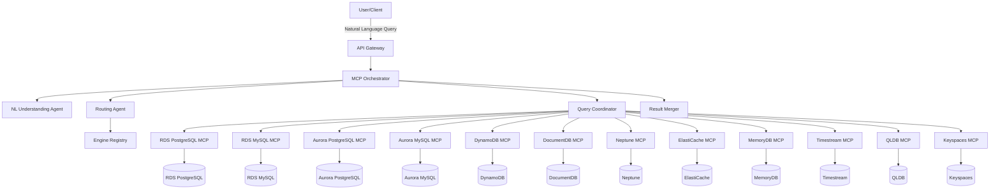
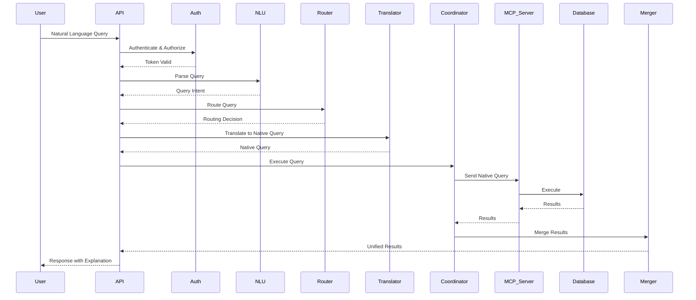
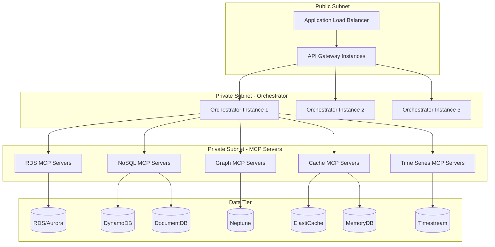
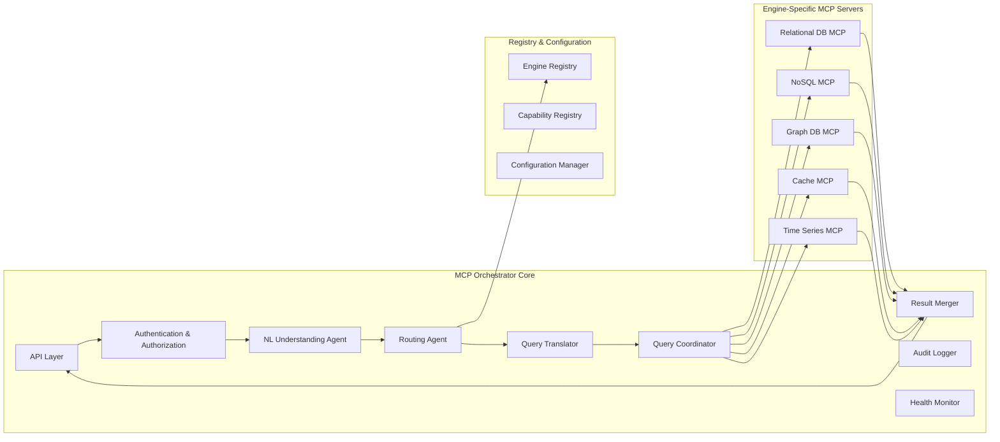

# Agentic MCP Database Orchestrator

> An intelligent architecture pattern for natural language interaction with AWS managed database services using Model Context Protocol (MCP) and AI agents.

## Table of Contents

- [Overview](#overview)
- [Requirements](#requirements)
- [Architecture & Design](#architecture--design)
- [Implementation Plan](#implementation-plan)
- [Getting Started](#getting-started)

---

## Overview

The Agentic MCP Database Orchestrator is an intelligent middleware system that enables users to interact with multiple AWS managed database services through natural language. The system accepts natural language queries, uses AI agents to determine the optimal database engine and routing strategy, coordinates with engine-specific MCP servers, and returns unified results to customers.

### Key Features

- 🧠 **Natural Language Processing**: Query any AWS database using plain English
- 🎯 **Intelligent Routing**: AI agents automatically select the best database engine for your query
- 🔄 **Multi-Database Coordination**: Execute queries across multiple databases seamlessly
- 🔒 **Enterprise Security**: IAM authentication, RBAC, and comprehensive audit logging
- 📊 **Schema Discovery**: Explore database structures across all engines
- 🚀 **High Performance**: Parallel query execution with connection pooling
- 📈 **Observability**: Built-in monitoring, tracing, and health checks

### Supported AWS Database Services

- **Relational**: RDS (PostgreSQL, MySQL, MariaDB, Oracle, SQL Server), Aurora (PostgreSQL, MySQL)
- **NoSQL**: DynamoDB, DocumentDB, Keyspaces
- **Graph**: Neptune
- **Cache**: ElastiCache, MemoryDB
- **Specialized**: Timestream, QLDB

---

## Requirements

### Glossary

- **MCP Orchestrator**: The central intelligent routing system that receives natural language input and coordinates with engine-specific MCP servers
- **Engine-Specific MCP Server**: An MCP server implementation tailored to a specific AWS database engine
- **Routing Agent**: An AI agent that analyzes natural language queries to determine the appropriate database engine
- **Query Translator**: A component that converts natural language into engine-specific query syntax
- **AWS Managed Database Services**: The collection of AWS database offerings
- **User**: The end customer or developer submitting natural language queries
- **Natural Language Query**: A user request expressed in plain English rather than database-specific syntax

### User Stories and Acceptance Criteria

#### 1. Natural Language Query Processing

**User Story:** As a developer, I want to query any AWS managed database using natural language, so that I don't need to learn multiple database-specific query languages

**Acceptance Criteria:**
1. WHEN the User submits a natural language query, THE MCP Orchestrator SHALL accept the input and initiate processing
2. THE MCP Orchestrator SHALL support natural language queries for all AWS Managed Database Services
3. WHEN the User submits a query, THE MCP Orchestrator SHALL return results in a consistent format regardless of the underlying database engine
4. THE MCP Orchestrator SHALL preserve the semantic intent of the User's natural language query during translation

#### 2. Intelligent Query Routing

**User Story:** As a system architect, I want the orchestrator to intelligently route queries to the correct database engine, so that queries are executed against the most appropriate data source

**Acceptance Criteria:**
1. WHEN the MCP Orchestrator receives a natural language query, THE Routing Agent SHALL analyze the query to determine the target database engine
2. THE Routing Agent SHALL consider query semantics, data model requirements, and available database engines when making routing decisions
3. IF multiple database engines could satisfy a query, THEN THE Routing Agent SHALL select the optimal engine based on query characteristics and performance considerations
4. THE Routing Agent SHALL provide reasoning for its routing decision to enable transparency and debugging
5. WHEN the target database engine is identified, THE MCP Orchestrator SHALL establish connection with the appropriate Engine-Specific MCP Server

#### 3. Engine-Specific MCP Servers

**User Story:** As a database administrator, I want each AWS database engine to have its own specialized MCP server, so that engine-specific features and optimizations can be leveraged

**Acceptance Criteria:**
1. THE MCP Orchestrator SHALL maintain connections to Engine-Specific MCP Servers for each supported AWS Managed Database Service
2. WHEN an Engine-Specific MCP Server is unavailable, THE MCP Orchestrator SHALL return an error message indicating the service is unavailable
3. THE Engine-Specific MCP Server SHALL translate natural language queries into native query syntax for its database engine
4. THE Engine-Specific MCP Server SHALL execute queries against the target database and return results to the MCP Orchestrator
5. THE Engine-Specific MCP Server SHALL handle engine-specific authentication and connection management

#### 4. Multi-Database Query Coordination

**User Story:** As a developer, I want the system to handle complex queries that might span multiple databases, so that I can retrieve comprehensive results without manual coordination

**Acceptance Criteria:**
1. WHEN a natural language query requires data from multiple database engines, THE Routing Agent SHALL identify all required data sources
2. THE MCP Orchestrator SHALL coordinate parallel or sequential queries across multiple Engine-Specific MCP Servers
3. THE MCP Orchestrator SHALL merge results from multiple database engines into a unified response
4. WHEN cross-database queries are executed, THE MCP Orchestrator SHALL maintain transaction semantics where applicable
5. THE MCP Orchestrator SHALL provide query execution plans showing which databases were accessed

#### 5. Security and Authorization

**User Story:** As a security engineer, I want all database access to be authenticated and authorized, so that data remains secure and compliant

**Acceptance Criteria:**
1. THE MCP Orchestrator SHALL authenticate the User before processing any queries
2. THE MCP Orchestrator SHALL verify the User has authorization to access the requested database engines
3. THE Engine-Specific MCP Server SHALL use IAM authentication or database-native authentication when connecting to AWS Managed Database Services
4. THE MCP Orchestrator SHALL log all query requests, routing decisions, and results for audit purposes
5. IF the User lacks authorization for a database engine, THEN THE MCP Orchestrator SHALL return an authorization error without executing the query

#### 6. Query Transparency and Debugging

**User Story:** As a developer, I want to understand how my natural language query was interpreted and executed, so that I can refine my queries and troubleshoot issues

**Acceptance Criteria:**
1. THE MCP Orchestrator SHALL provide an explanation of how the natural language query was interpreted
2. THE MCP Orchestrator SHALL show which database engine was selected and why
3. THE MCP Orchestrator SHALL display the translated native query syntax for each database engine accessed
4. WHEN errors occur, THE MCP Orchestrator SHALL provide detailed error messages including the failure point in the query pipeline
5. THE MCP Orchestrator SHALL include execution time and performance metrics in the response

#### 7. Fault Tolerance and Reliability

**User Story:** As a system operator, I want the orchestrator to handle failures gracefully, so that the system remains reliable and provides useful feedback

**Acceptance Criteria:**
1. WHEN an Engine-Specific MCP Server fails, THE MCP Orchestrator SHALL retry the request up to three times with exponential backoff
2. IF all retry attempts fail, THEN THE MCP Orchestrator SHALL return a detailed error message to the User
3. WHEN a database connection times out, THE MCP Orchestrator SHALL terminate the query and return a timeout error within 30 seconds
4. THE MCP Orchestrator SHALL continue operating even when individual Engine-Specific MCP Servers are unavailable
5. THE MCP Orchestrator SHALL monitor health of all Engine-Specific MCP Servers and report status

#### 8. Schema Discovery

**User Story:** As a developer, I want to perform schema discovery and metadata queries, so that I can understand the structure of available databases

**Acceptance Criteria:**
1. THE MCP Orchestrator SHALL support natural language queries for schema information across all database engines
2. WHEN the User requests schema information, THE MCP Orchestrator SHALL query the appropriate Engine-Specific MCP Server for metadata
3. THE MCP Orchestrator SHALL return schema information in a standardized format regardless of database engine
4. THE MCP Orchestrator SHALL support queries about table structures, indexes, relationships, and constraints
5. THE MCP Orchestrator SHALL provide a catalog of available databases and their engines

#### 9. Data Manipulation Operations

**User Story:** As a developer, I want to execute data manipulation operations through natural language, so that I can modify data without writing engine-specific syntax

**Acceptance Criteria:**
1. THE MCP Orchestrator SHALL support natural language requests for INSERT, UPDATE, and DELETE operations
2. WHEN the User requests a data modification, THE MCP Orchestrator SHALL require explicit confirmation before execution
3. THE Query Translator SHALL convert natural language data manipulation requests into safe, parameterized queries
4. THE MCP Orchestrator SHALL return the number of affected rows after data manipulation operations
5. IF a data manipulation request is ambiguous, THEN THE MCP Orchestrator SHALL request clarification from the User before execution

#### 10. Extensible Engine Support

**User Story:** As a system architect, I want the orchestrator to support multiple AWS database engines, so that the system can serve diverse use cases

**Acceptance Criteria:**
1. THE MCP Orchestrator SHALL support Engine-Specific MCP Servers for RDS Aurora PostgreSQL, Aurora MySQL, PostgreSQL, MySQL, MariaDB, Oracle, and SQL Server
2. THE MCP Orchestrator SHALL support Engine-Specific MCP Servers for DynamoDB, DocumentDB, Neptune, ElastiCache, MemoryDB, Timestream, QLDB, and Keyspaces
3. THE MCP Orchestrator SHALL allow dynamic registration of new Engine-Specific MCP Servers without system restart
4. THE MCP Orchestrator SHALL maintain a registry of supported database engines and their capabilities
5. WHEN a new AWS Managed Database Service is added, THE MCP Orchestrator SHALL support integration through a standardized Engine-Specific MCP Server interface

---

## Architecture & Design

### High-Level Architecture



### Core Components

#### 1. API Gateway
Entry point for all user requests, handles HTTP/WebSocket connections.

**Key Endpoints:**
- `POST /query` - Submit natural language queries
- `WS /session` - Interactive query sessions
- `GET /schema/{engine?}` - Schema discovery
- `GET /health` - System health check

#### 2. Authentication & Authorization Module
Secures access to database resources with IAM, API keys, or OAuth.

#### 3. Natural Language Understanding Agent
Parses and understands user intent from natural language queries.

**Capabilities:**
- Extract query intent (SELECT, INSERT, UPDATE, DELETE, SCHEMA)
- Identify entities (tables, columns, values, conditions)
- Detect query complexity (single vs multi-database)
- Handle ambiguity and request clarification

#### 4. Routing Agent
Determines the optimal database engine(s) for query execution.

**Routing Strategies:**
- Single: Route to one database
- Parallel: Execute across multiple databases simultaneously
- Sequential: Execute queries in order with dependencies
- Federated: Coordinate complex cross-database queries

#### 5. Engine Registry
Maintains catalog of available database engines and their capabilities.

#### 6. Query Translator
Converts natural language intent into engine-specific query syntax.

**Supported Translations:**
- SQL (PostgreSQL, MySQL, Oracle, SQL Server)
- NoSQL (DynamoDB PartiQL, DocumentDB MongoDB, Keyspaces CQL)
- Graph (Neptune Gremlin)
- Specialized (Timestream, QLDB PartiQL)

#### 7. Query Coordinator
Executes queries across one or more engine-specific MCP servers.

**Features:**
- Connection pooling
- Timeout handling
- Retry with exponential backoff
- Transaction coordination

#### 8. Engine-Specific MCP Servers
Standardized interface for all database engine MCP servers.

**Responsibilities:**
- Accept native queries from coordinator
- Manage database connections and authentication
- Execute queries against target database
- Return results in standardized format

#### 9. Result Merger
Combines results from multiple database engines into unified response.

**Capabilities:**
- Merge data from multiple sources
- Handle schema differences
- Apply post-processing (sorting, filtering, aggregation)
- Generate execution summary

#### 10. Audit Logger
Logs all operations for security, compliance, and debugging.

#### 11. Health Monitor
Monitors health and availability of all engine-specific MCP servers.

### Data Flow



### Key Interfaces

#### QueryIntent
```typescript
interface QueryIntent {
  operation: 'select' | 'insert' | 'update' | 'delete' | 'schema' | 'describe';
  entities: Entity[];
  filters: Filter[];
  joins?: Join[];
  aggregations?: Aggregation[];
  sorting?: Sort[];
  confidence: number;
  ambiguities?: Ambiguity[];
}
```

#### RoutingDecision
```typescript
interface RoutingDecision {
  primary: EngineTarget;
  secondary?: EngineTarget[];
  strategy: 'single' | 'parallel' | 'sequential' | 'federated';
  rationale: string;
  confidence: number;
}
```

#### NativeQuery
```typescript
interface NativeQuery {
  engine: string;
  syntax: string;
  query: string;
  parameters: Record<string, any>;
  estimatedCost?: number;
}
```

#### ExecutionResult
```typescript
interface ExecutionResult {
  queryId: string;
  engine: string;
  status: 'success' | 'error' | 'timeout';
  data?: any[];
  rowCount?: number;
  executionTime: number;
  error?: Error;
}
```

### Error Handling

**Error Categories:**
1. Authentication Errors
2. Authorization Errors
3. Validation Errors
4. Routing Errors
5. Execution Errors
6. Translation Errors

**Retry Strategy:**
- Connection Failures: 3 retries with exponential backoff (1s, 2s, 4s)
- Timeout Errors: No retry
- Transient Errors: 2 retries with 1s delay
- Authentication Errors: No retry

### Deployment Architecture



**Deployment Considerations:**
- Orchestrator: Containerized service (ECS/EKS) with auto-scaling
- Engine-Specific MCP Servers: Separate services per engine type
- High Availability: Multi-AZ deployment with 2+ instances per component
- Load Balancing: Application Load Balancer for API Gateway
- Service Discovery: AWS Cloud Map or internal DNS
- Configuration: AWS Systems Manager Parameter Store / Secrets Manager
- Monitoring: CloudWatch metrics, X-Ray tracing

### Security

1. **Network Security**: VPC with security groups
2. **Encryption**: TLS for all communication, encryption at rest
3. **IAM Integration**: IAM roles for service-to-service auth
4. **Secrets Management**: AWS Secrets Manager for credentials
5. **Audit Logging**: All queries logged to CloudWatch
6. **Input Validation**: Sanitize all user inputs
7. **Query Safety**: Parameterized queries to prevent injection

### Monitoring & Observability

**Metrics:**
- Query latency (p50, p95, p99)
- Query throughput (queries/sec)
- Error rates by category
- Engine availability
- Connection pool utilization
- Cache hit rates

**Logging:**
- Structured JSON logs
- Correlation IDs for tracing
- Centralized to CloudWatch Logs

**Tracing:**
- AWS X-Ray distributed tracing
- End-to-end query flow visibility

---

## Implementation Plan

### Phase 1: Foundation (Tasks 1-3)

#### Task 1: Set up project structure and core interfaces
- Create directory structure for orchestrator, agents, MCP servers, and shared utilities
- Define TypeScript interfaces for all core components
- Set up configuration management
- Create shared types package

#### Task 2: Implement Engine Registry and Configuration
- **2.1** Create Engine Registry service with registration/deregistration
- **2.2** Create Engine Capability definitions for all AWS database types
- **2.3** Implement Configuration Manager with environment-based config

#### Task 3: Implement Authentication and Authorization Module
- **3.1** Create authentication service (IAM, API key, session tokens)
- **3.2** Create authorization service (RBAC, permission checking)
- **3.3** Implement audit logging for auth events

### Phase 2: Intelligence Layer (Tasks 4-6)

#### Task 4: Implement Natural Language Understanding Agent
- **4.1** Create NLU Agent core (intent extraction, entity recognition)
- **4.2** Implement ambiguity detection and clarification
- **4.3** Add context-aware query understanding

#### Task 5: Implement Routing Agent
- **5.1** Create routing decision engine with scoring system
- **5.2** Implement routing rationale generator
- **5.3** Add engine capability matching

#### Task 6: Implement Query Translator
- **6.1** Create SQL translator for relational databases
- **6.2** Create NoSQL translators (DynamoDB, DocumentDB, Keyspaces)
- **6.3** Create specialized database translators (Neptune, Timestream, QLDB)
- **6.4** Implement query validation and optimization

### Phase 3: Execution Layer (Tasks 7-9)

#### Task 7: Implement Engine-Specific MCP Server Interface
- **7.1** Create base MCP server interface
- **7.2** Implement RDS/Aurora MCP servers
- **7.3** Implement NoSQL MCP servers
- **7.4** Implement specialized database MCP servers
- **7.5** Implement IAM authentication for MCP servers

#### Task 8: Implement Query Coordinator
- **8.1** Create execution plan builder
- **8.2** Implement query execution engine
- **8.3** Add retry and error handling
- **8.4** Implement transaction coordination

#### Task 9: Implement Result Merger
- **9.1** Create result merging logic
- **9.2** Implement post-processing operations
- **9.3** Create execution summary generator
- **9.4** Implement result formatting

### Phase 4: API & Features (Tasks 10-12)

#### Task 10: Implement API Gateway
- **10.1** Create REST API endpoints
- **10.2** Implement WebSocket support for interactive sessions
- **10.3** Add API middleware (auth, logging, rate limiting)
- **10.4** Implement response formatting

#### Task 11: Implement Schema Discovery
- **11.1** Create schema discovery service
- **11.2** Implement relational database schema discovery
- **11.3** Implement NoSQL schema discovery
- **11.4** Implement specialized database schema discovery

#### Task 12: Implement Data Manipulation Operations
- **12.1** Create data modification handlers (INSERT, UPDATE, DELETE)
- **12.2** Add safety mechanisms for data modifications
- **12.3** Implement modification result reporting

### Phase 5: Operations (Tasks 13-15)

#### Task 13: Implement Audit Logging
- **13.1** Create audit logger service
- **13.2** Implement query audit logging
- **13.3** Add security event logging

#### Task 14: Implement Health Monitoring
- **14.1** Create health monitor service
- **14.2** Implement health status reporting
- **14.3** Add metrics collection

#### Task 15: Implement Query Explanation
- **15.1** Create explanation generator
- **15.2** Add execution plan visualization
- **15.3** Implement error explanation

### Phase 6: Deployment & Testing (Tasks 16-18)

#### Task 16: Create deployment configuration
- **16.1** Create Docker containers
- **16.2** Create Kubernetes/ECS deployment manifests
- **16.3** Create infrastructure as code (Terraform/CloudFormation)

#### Task 17: Create example implementations and documentation
- **17.1** Create example queries
- **17.2** Create API documentation (OpenAPI spec)
- **17.3** Create deployment guide

#### Task 18: Create integration tests (Optional)
- **18.1** Create end-to-end test suite
- **18.2** Create engine-specific tests
- **18.3** Create performance tests

---

## Getting Started

### Prerequisites

- Node.js 18+ or Python 3.9+
- Docker and Kubernetes/ECS for deployment
- AWS Account with access to managed database services
- IAM permissions for database access

### Quick Start

1. **Clone the repository**
   ```bash
   git clone <repository-url>
   cd agentic-mcp-database-orchestrator
   ```

2. **Install dependencies**
   ```bash
   npm install
   # or
   pip install -r requirements.txt
   ```

3. **Configure engines**
   Edit `config/engines.json` to add your database endpoints:
   ```json
   {
     "engines": [
       {
         "id": "aurora-postgres-prod",
         "type": "relational",
         "mcpServerUrl": "http://localhost:3001",
         "credentials": "arn:aws:secretsmanager:..."
       }
     ]
   }
   ```

4. **Start the orchestrator**
   ```bash
   npm run start
   # or
   python -m orchestrator.main
   ```

5. **Test with a query**
   ```bash
   curl -X POST http://localhost:3000/query \
     -H "Content-Type: application/json" \
     -d '{"query": "Show me all users created in the last 7 days"}'
   ```

### Example Queries

**Simple SELECT:**
```
"Show me all customers from the users table"
```

**Aggregation:**
```
"What's the total revenue by product category this month?"
```

**Multi-Database:**
```
"Get user profiles from PostgreSQL and their recent orders from DynamoDB"
```

**Schema Discovery:**
```
"What tables are available in the sales database?"
```

**Data Modification:**
```
"Update the email address for user ID 12345 to newemail@example.com"
```

### Configuration

See `docs/configuration.md` for detailed configuration options.

### Deployment

See `docs/deployment.md` for production deployment instructions.

### Contributing

Contributions are welcome! Please see `CONTRIBUTING.md` for guidelines.

### License

[Your License Here]

---

## Architecture Diagrams

### Component Architecture



---

## Contact & Support

For questions, issues, or contributions, please [open an issue](https://github.com/your-org/agentic-mcp-database-orchestrator/issues) or contact the maintainers.
